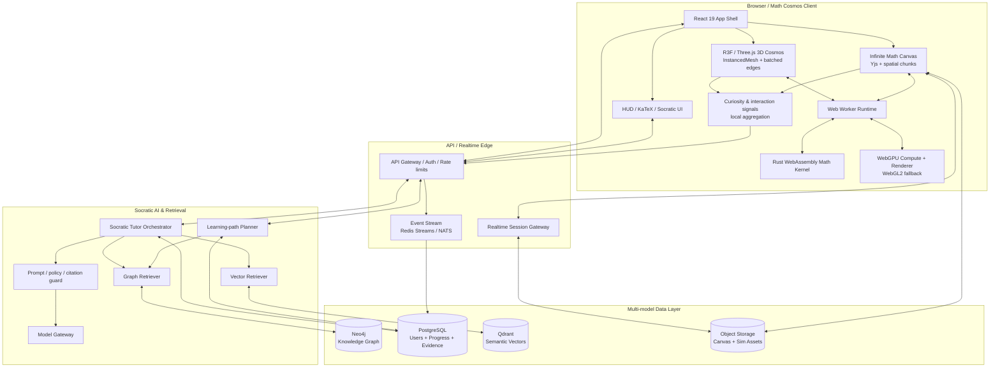

# Math Cosmos — Ultimate System Architecture

> Math Cosmos is the spatial, simulation-first evolution layer for MathNexus. The existing Knowledge Graph, Ontology, mastery evidence, practice engine and AI context remain the learning core. Math Cosmos adds a 3D universe, WebGPU simulation layer, spatial canvas and curiosity-driven orchestration on top.

## PART 1 — Ultimate System Architecture

### Technology stack

| Layer | Choice | Why |
| --- | --- | --- |
| Web shell | React 19 + TypeScript + Vite | Already proven in MathNexus; fast lazy-loaded feature islands and PWA support. |
| 3D scene graph | Three.js + React-Three-Fiber + Drei | React composition with direct access to Three primitives; supports InstancedMesh, custom shaders and later WebGPU renderer migration. |
| Camera / spatial transitions | GSAP | Deterministic cinematic camera fly-through with interruption/overwrite control. |
| Math typography | KaTeX | Fast, safe formula rendering already integrated in MathNexus. |
| High precision client math | decimal.js | Decimal arithmetic for scales where IEEE-754 float rounding is inappropriate. |
| Numerical / tensor Wasm kernel | Rust + wasm-bindgen + nalgebra | Deterministic high-performance numerical kernels off the main thread. |
| GPU compute | WebGPU compute pipelines | N-body, PDE grids, fractals, particle systems and geometry deformation; WebGL2 remains a visual fallback. |
| Worker orchestration | Web Workers + Comlink-style RPC | Keeps graph layout and simulation computation away from the React/main thread. |
| Infinite spatial canvas | Yjs CRDT + tile/chunk spatial index | Persistent zoomable canvas that can later become collaborative without central edit locks. |
| Graph database | Neo4j | Native concept/theorem/prerequisite/path traversal. |
| Relational store | PostgreSQL | Users, progress, mastery evidence, discovery events, canvas metadata and permissions. |
| Vector database | Qdrant | Semantic retrieval for definitions, historical notes, proofs, examples and user-owned notes. |
| Object storage | S3-compatible storage | Canvas snapshots, simulation checkpoints, media and generated assets. |
| AI orchestrator | TypeScript/Node service + model gateway | Combines graph retrieval, vector retrieval, mastery context and Socratic policy before calling models. |
| Realtime/event layer | Redis Streams / NATS JetStream | Discovery events, simulation collaboration, mastery updates and reward events. |
| Observability | OpenTelemetry + traces/metrics/logs | Correlates render, Wasm, retrieval and model latency. |

### Performance principles

1. Render nodes with **InstancedMesh**, not one React component / draw call per node.
2. Render relation edges as batched BufferGeometry line segments.
3. Calculate large force layouts in a Worker/Wasm Barnes-Hut solver, then stream position buffers to the renderer.
4. Separate visual coordinates from canonical graph data. The database never stores camera-specific truth as concept truth.
5. Keep simulation state in typed arrays. Move bulk numeric kernels into Wasm/WebGPU.
6. Prefer progressive disclosure: Domain -> Concept -> Knowledge Atom. Do not render every ontology atom at once.
7. Adaptive quality budget: lower DPR, particles and simulation resolution before dropping interaction FPS.
8. Never block the knowledge UI on WebGPU. WebGL2/2D views remain fallbacks.

### Architecture diagram



### Runtime boundary

- **React** owns UI state, accessibility, routing and progressive disclosure.
- **Three/R3F** owns scene rendering and picking.
- **Worker/Wasm** owns expensive deterministic math and layout.
- **WebGPU** owns massively parallel numeric work.
- **Server graph/vector services** own knowledge retrieval, not browser-side hidden truth.
- **AI** receives retrieved evidence and mastery context; it does not become the source of mathematical truth.

---

## PART 2 — Multi-model Database Schema

### Neo4j knowledge model

Core node labels:

```text
(:Domain)
(:Concept)
(:Definition)
(:Theorem)
(:Lemma)
(:Proof)
(:Formula)
(:Example)
(:Counterexample)
(:Exercise)
(:Application)
(:HistoricalContext)
```

Core relationships:

```text
(:Domain)-[:CONTAINS]->(:Concept)
(:Concept)-[:PREREQUISITE_OF]->(:Concept)
(:Definition)-[:DEFINES]->(:Concept)
(:Theorem)-[:ABOUT]->(:Concept)
(:Lemma)-[:SUPPORTS]->(:Theorem)
(:Proof)-[:PROVES]->(:Theorem)
(:Proof)-[:USES]->(:Definition|:Lemma|:Theorem)
(:Example)-[:ILLUSTRATES]->(:Concept|:Theorem)
(:Counterexample)-[:REFUTES]->(:Misconception)
(:Exercise)-[:ASSESSES]->(:Concept)
(:Concept)-[:RELATES_TO {weight, relationType}]->(:Concept)
(:Concept)-[:APPLIES_IN]->(:Application)
```

Example:

```cypher
MERGE (fib:Concept {id: "fibonacci"})
SET fib.title = "Fibonacci Sequence"

MERGE (phi:Concept {id: "golden-ratio"})
SET phi.title = "Golden Ratio"

MERGE (fib)-[:RELATES_TO {
  relationType: "asymptotic_ratio",
  weight: 0.94,
  explanation: "F(n+1)/F(n) approaches phi"
}]->(phi)
```

### PostgreSQL user/progression model

```sql
CREATE TABLE user_profile (
  user_id uuid PRIMARY KEY,
  created_at timestamptz NOT NULL DEFAULT now(),
  locale text NOT NULL DEFAULT 'vi'
);

CREATE TABLE discovery_event (
  id uuid PRIMARY KEY,
  user_id uuid NOT NULL REFERENCES user_profile(user_id),
  concept_id text NOT NULL,
  event_type text NOT NULL,
  dwell_ms integer,
  camera_distance numeric,
  exploration_depth integer,
  created_at timestamptz NOT NULL DEFAULT now()
);

CREATE TABLE mastery_evidence (
  id uuid PRIMARY KEY,
  user_id uuid NOT NULL REFERENCES user_profile(user_id),
  concept_id text NOT NULL,
  evidence_type text NOT NULL,
  source_id text,
  correctness numeric,
  confidence numeric NOT NULL,
  created_at timestamptz NOT NULL DEFAULT now()
);

CREATE TABLE passion_metric_snapshot (
  user_id uuid NOT NULL REFERENCES user_profile(user_id),
  window_start timestamptz NOT NULL,
  curiosity_score numeric NOT NULL,
  persistence_score numeric NOT NULL,
  novelty_score numeric NOT NULL,
  flow_estimate numeric NOT NULL,
  PRIMARY KEY (user_id, window_start)
);

CREATE TABLE universe_state (
  user_id uuid PRIMARY KEY REFERENCES user_profile(user_id),
  discovered_concepts jsonb NOT NULL DEFAULT '[]',
  pinned_concepts jsonb NOT NULL DEFAULT '[]',
  camera_bookmarks jsonb NOT NULL DEFAULT '[]',
  updated_at timestamptz NOT NULL DEFAULT now()
);

CREATE TABLE spatial_canvas (
  canvas_id uuid PRIMARY KEY,
  user_id uuid NOT NULL REFERENCES user_profile(user_id),
  title text NOT NULL,
  yjs_state_object_key text NOT NULL,
  viewport jsonb NOT NULL,
  updated_at timestamptz NOT NULL DEFAULT now()
);
```

### Qdrant vector collections

```text
Collection: math_knowledge
payload:
  entity_id
  entity_type
  concept_id
  domain_id
  title
  source
  difficulty
  verified
  language

vectors:
  semantic_embedding

Collection: user_notes
payload:
  user_id
  canvas_id
  note_id
  concept_links[]
```

### Discovery flow: Fibonacci -> Golden Ratio

1. User flies to **Fibonacci** and spends meaningful time rotating/exploring the node.
2. Client emits a batched `DISCOVER_CONCEPT(fibonacci)` event.
3. Event service stores the discovery row in PostgreSQL.
4. Graph planner asks Neo4j for high-value adjacent concepts not yet discovered.
5. Neo4j returns **Golden Ratio** through the `asymptotic_ratio` relation.
6. `universe_state.discovered_concepts` adds Fibonacci and marks Golden Ratio as a visible frontier, not automatically "learned".
7. Passion Metric receives curiosity/persistence evidence but **does not change mastery score**.
8. 3D client animates a new relation filament from Fibonacci toward Golden Ratio.
9. If the user opens the relation, RAG fetches:
   - graph relation explanation,
   - verified theorem/history chunks from Qdrant,
   - user's prior notes,
   - current mastery evidence.
10. Socratic tutor asks a guiding question such as: “Nếu chia hai số Fibonacci liên tiếp, bạn dự đoán tỉ số sẽ đi về đâu?”

This separation is deliberate: **discovery != mastery**.

---

## PART 3 — Production-ready 3D Graph Core

Implemented proof of concept in:

- `src/cosmos/cosmosGraph.ts`
- `src/cosmos/MathCosmosGraph.tsx`
- `src/pages/MathCosmos.tsx`

### Rendering strategy

- One `THREE.InstancedMesh` renders all currently disclosed nodes.
- One `THREE.BufferGeometry` renders all edges as batched `lineSegments`.
- Domain and concept positions are deterministic so reloads do not reshuffle the user's mental map.
- Force layout now runs in a dedicated Web Worker and returns positions through a transferable `Float32Array`.
- Repulsion uses a uniform 3D spatial hash so layout work is local rather than a naive all-pairs scan.
- Spring forces still preserve graph relations and deterministic domain anchors.
- Existing node positions are pinned when ontology micro-nodes expand, preserving spatial memory instead of reshuffling the universe.
- If Worker startup/execution fails, the exact same deterministic layout engine runs as a synchronous fallback.
- Clicking an instance uses `instanceId` to map GPU instance -> graph node.
- GSAP animates the real Three camera to the selected node.
- Concept selection expands ontology atoms as micro-nodes.
- HUD formulas use the existing safe KaTeX path.

### Scale path

```text
0-1,000 disclosed nodes:
  Web Worker deterministic relaxation
  spatial-hash local repulsion
  transferable Float32Array positions
  camera-radius disclosure in InstancedMesh

1,000-10,000 graph nodes:
  keep Worker boundary
  upgrade repulsion to Barnes-Hut/octree when profiling proves necessary
  progressive graph disclosure / LOD

10,000-100,000 stored knowledge entities:
  server-side graph culling
  InstancedMesh / Points for visible subsets
  GPU picking or worker spatial queries

Physics simulation:
  WebGPU compute buffers, never React state per particle
```

---

## PART 4 — Cognitive / Passion Engine Pseudocode

The engine should estimate **interaction state**, not claim to diagnose emotion. Raw micro-interactions should be aggregated locally where possible and users should be able to disable adaptive effects.

```text
STATE:
  rolling_window = last 90 seconds
  curiosity = 0
  persistence = 0
  novelty = 0
  friction = 0
  flow_estimate = 0

ON interaction(event):
  add event to rolling_window
  discard events older than 90 seconds

  signals = {
    deliberate_exploration:
      normalized(unique_nodes_opened + relation_expansions),

    depth:
      normalized(max_ontology_depth_reached),

    persistence:
      normalized(retries_after_error + return_to_hard_node),

    self_directed_questions:
      normalized(user_questions_not_triggered_by_system),

    rapid_failure_loop:
      normalized(repeated_wrong_attempts_with_short_latency),

    frantic_navigation:
      normalized(high_camera_velocity + rapid_backtracking),

    disengagement:
      normalized(long_idle_after_error),

    hint_dependency:
      normalized(hint_requests_without_intermediate_attempts)
  }

  curiosity =
    0.30 * signals.deliberate_exploration +
    0.25 * signals.depth +
    0.25 * signals.self_directed_questions +
    0.20 * novelty_of_recent_concepts

  persistence =
    0.55 * signals.persistence +
    0.25 * sustained_time_on_hard_concept +
    0.20 * recovery_after_failure

  friction =
    0.40 * signals.rapid_failure_loop +
    0.30 * signals.frantic_navigation +
    0.30 * signals.disengagement

  flow_estimate =
    clamp(
      0.35 * curiosity +
      0.35 * persistence +
      0.20 * challenge_skill_balance -
      0.30 * friction
    )

  IF friction > 0.72 for 20 seconds:
    reduce_visual_noise()
    suppress_reward_particles()
    offer_one_socratic_hint()
    do_not_lower_mastery_threshold()

  IF persistence > 0.80
     AND hard_concept_solved
     AND no_reward_in_last_10_minutes:

    dispatch_visual_event(
      type = "SUPERNOVA",
      position = solved_node.position,
      intensity = map(persistence, 0.8..1.0 -> 0.6..1.0),
      duration_ms = 1800
    )

    increment_passion_metric(
      reason = "intellectual_persistence",
      bounded_delta = small_positive_value
    )

  IF curiosity > 0.78 AND current_domain_exhausted:
    reveal_frontier_nodes(
      rank_by = graph_relevance * novelty * prerequisite_readiness
    )

PRIVACY RULES:
  never infer clinical or mental-health status
  never store raw pointer paths by default
  aggregate interaction features on-device
  expire fine-grained event data quickly
  passion score must not affect grades/mastery truth
  user can disable adaptive visual feedback
```

## Rollout plan

### Phase 0 — Completed foundation
- R3F + Three renderer
- InstancedMesh nodes
- batched edges
- GSAP fly-through
- ontology expansion
- KaTeX HUD
- WebGPU capability indicator

### Phase 1 — In progress / partially completed
Completed:
- graph-layout Web Worker
- transferable Float32Array position buffers
- deterministic synchronous fallback
- spatial-hash layout acceleration
- camera-radius node disclosure
- mobile quality profile
- reduced-motion hardening
- shared deterministic retrieval for Search/AI/Cosmos

Still justified next:
- persisted camera bookmarks
- profiling-driven Barnes-Hut/octree only when graph size requires it
- discovery events
- worker/GPU picking for very large visible sets

### Phase 2 — WebGPU Math & Physics Lab
- Wasm tensor/numerical kernel
- N-body compute pipeline
- Mandelbrot/Julia/biological fractal compute
- geodesic/GR visual sandbox
- adaptive resolution controller

### Phase 3 — Infinite Math Canvas
- Yjs document
- spatial chunk index
- formula blocks, vector drawing and graph embeds
- references from canvas objects back to graph concepts
- optional realtime collaboration

### Phase 4 — Socratic Graph-RAG
- Neo4j prerequisite/path retrieval
- Qdrant semantic retrieval
- verified-source ranking
- mastery-aware Socratic planner
- answer policy: questions/hints/counterexamples before direct solution

### Phase 5 — Curiosity / Passion loop
- privacy-preserving local signal aggregation
- opt-in adaptive feedback
- intellectual-persistence rewards
- frontier recommendation engine


---

## Simulation Engine Foundation — Phase 4/5 status

### Engine boundary

The first production simulation path now uses a small explicit contract:

```text
ParticleSimulationEngine
  backend
  particleCount
  step(dt)
  writePositions(Float32Array)
  getMetrics()
  reset(seed)
  dispose()
```

Current backend:

```text
CpuNBodyEngine
  internal position/velocity/acceleration/mass state: Float64Array
  renderer transfer buffer: Float32Array
  integrator: leapfrog / velocity Verlet
  singularity control: Plummer-style softening
  deterministic initialization: seeded PRNG
```

React owns only user-facing controls such as pause, speed, body count and seed. Particle positions are never copied into React state per frame.

### Numerical policy

The current gravity laboratory uses dimensionless simulation units. It does **not** claim SI-scale astrophysical fidelity.

The CPU engine:
- evaluates all pair gravity directly;
- uses Float64 internal state;
- splits large render-frame intervals into bounded substeps;
- exposes total, kinetic and potential energy diagnostics;
- exposes center-of-mass drift;
- caps the public body count to a range suitable for the O(N²) CPU backend.

The renderer receives only a Float32 position buffer because visual precision requirements differ from numerical-state requirements.

### WebGPU status

WebGPU compute for N-body is **not implemented yet**.

The presence of browser WebGPU support is not treated as a simulation backend. A future `WebGpuNBodyEngine` must satisfy the same external engine contract and pass equivalent numerical/fallback tests before automatic backend selection is enabled.

### Knowledge integration

The gravity lab links into the existing graph through:
- vectors;
- derivative concepts;
- first-order differential equations;
- Calculus Lab.

A dedicated Classical Mechanics / Newtonian Gravity domain expansion is deferred to the subsequent graph-integration phase rather than inventing a disconnected second ontology.

### Phase status

Completed:
- SimulationEngine contract;
- deterministic CPU N-body engine;
- TypedArray state;
- leapfrog integration;
- pause/resume/reset/speed controls;
- seed/body-count/softening controls;
- performance timing;
- energy-drift diagnostics;
- mobile rendering reduction;
- Knowledge Graph links.

Still next:
- WebGPU compute backend;
- backend selector with verified feature detection;
- simulation-to-concept events;
- Newtonian gravity / classical mechanics ontology expansion;
- additional simulations only after the engine boundary proves reusable.


---

## Phase 6 — Simulation ↔ Knowledge Graph integration

The gravity simulation is no longer an isolated visual tool.

A new **Mathematical Physics** domain now connects the running N-body lab to the canonical knowledge model:

```text
Vectors
  +
Derivative definition
  ↓
Classical Mechanics
  +
First-order ODE
  ↓
Newtonian Gravity
  ↓
N-body Problem
  ↘
Hamiltonian Mechanics
```

### Canonical concepts

- `classical-mechanics`
- `newtonian-gravity`
- `nbody-problem`
- `hamiltonian-mechanics`

The same IDs are consumed by:
- Knowledge Map;
- Math Cosmos;
- Search;
- Gemini/local retrieval context;
- Gravity Lab links;
- future adaptive learning-path logic.

### Deep ontology

The physics branch now includes:
- mechanical state;
- Newton's second law;
- momentum and momentum conservation;
- inverse-square gravity;
- vector acceleration;
- gravitational potential energy;
- coupled 6N-dimensional ODE state;
- timestep selection;
- energy-drift interpretation;
- numerical softening misconception;
- phase space;
- Hamiltonian dynamics;
- symplectic/leapfrog interpretation.

### Product rule

Simulation parameters are treated as **learning probes**, not mastery evidence by themselves.

Opening or changing the gravity simulation may support curiosity/discovery metrics later, but it must not automatically mark Newtonian gravity or N-body dynamics as mastered.


---

## Infinite Math Canvas Foundation — Phase 8 status

### Implemented architecture

The first Math Canvas is deliberately single-user and local-first.

Object model:

```text
MathCanvasState
  viewport
  title
  objects[]

MathCanvasObject
  stable id
  x / y
  width / height
  optional groupId
  createdAt / updatedAt

object types:
  text
  latex
  concept
  formula
  simulation
  link
  stroke
  arrow
```

The workspace reuses canonical MathNexus data:
- concept cards reference `MATH_CONCEPTS`;
- formula cards reference `FORMS`;
- simulation cards link to the real Gravity Lab;
- LaTeX rendering reuses the existing KaTeX/ChatText path.

### Spatial interaction

Implemented:
- pan mode;
- cursor-centered zoom;
- select and multi-select;
- group IDs;
- grouped dragging;
- freehand strokes;
- arrows;
- card dragging;
- persistent viewport;
- large vector workspace via SVG;
- mobile responsive inspector.

No object stores screen coordinates. Object coordinates are world coordinates and the viewport transform is stored separately.

### Persistence policy

Canvas persistence is independent from the legacy progress/notes backup schema.

Storage is:
- local-first;
- debounced by the page before writes;
- split into fixed-size object chunks;
- hash-compared so unchanged chunks are not rewritten;
- normalized on load so malformed objects are dropped instead of corrupting the workspace.

This avoids a single giant JSON document being rewritten on every pointer movement.

### Collaboration status

Yjs/CRDT is **not implemented yet**.

Collaboration is intentionally deferred until:
1. the single-user object schema is stable;
2. object operations are proven in E2E;
3. persistence/migration semantics are clear.

Future collaboration should sync object-level operations, not replace the workspace with one continuously rewritten JSON blob.

### Security/accessibility notes

- external link cards only activate HTTP/HTTPS URLs;
- Canvas remains usable without network access;
- toolbar actions are standard keyboard-focusable buttons;
- 3D/WebGPU is not required for Canvas;
- concepts/formulas remain reachable through normal MathNexus routes.

### Phase status

Completed:
- stable object IDs;
- serializable spatial state;
- pan/zoom;
- text and LaTeX blocks;
- concept/formula/simulation/link cards;
- free drawing;
- arrows;
- grouping;
- chunked/debounced persistence;
- local export;
- offline route coverage.

Still next:
- object resize handles;
- import with schema validation;
- richer graph/simulation embeds;
- keyboard spatial navigation;
- operation history / undo-redo;
- only then CRDT/Yjs collaboration.


---

## Socratic Tutor Contextual Integration — Phase 7 status

### Runtime pipeline

```text
Question
  ↓
Shared deterministic retrieval
  ↓
Concept anchors
  ↓
Local mastery evidence
  ↓
Tutor Planner
  ├─ DISCOVER
  ├─ GUIDED_HINT
  ├─ CONCEPT_EXPLANATION
  ├─ PROOF_GUIDANCE
  ├─ ERROR_DIAGNOSIS
  ├─ VISUAL_INTUITION
  └─ DIRECT_SOLUTION
  ↓
Validated server tutor policy
  ↓
Gemini + MathNexus context
```

### Policy

Default behavior is Socratic, not evasive.

The tutor should:
- ask or hint before revealing a complete solution when the learner did not request one;
- provide a complete solution when explicitly requested;
- explain concepts with intuition before notation when appropriate;
- diagnose the first incorrect step rather than rewriting an entire attempt;
- guide proofs using goals, hypotheses and relevant lemmas;
- use mastery only as bounded evidence, never as a psychological or intelligence inference.

### Trust boundary

The browser is untrusted.

Only a whitelisted tutor mode may affect the server system instruction.

Client-provided:
- mastery summaries;
- concept IDs;
- retrieved app context;

are placed in the user-context portion of the request, not in the system instruction.

Arbitrary client `strategy` strings are ignored server-side.

### Local fallback

When Gemini is unavailable, MathNexus still:
- retrieves local knowledge;
- selects a tutor mode;
- provides a mode-specific opening prompt;
- surfaces relevant concept/lesson/formula links.

This preserves useful learning behavior without pretending the local retrieval output is an LLM answer.

### Completed in Phase 7

- deterministic tutor intent classifier;
- user-selectable tutor modes;
- mastery-aware tutor planning;
- concept-anchor extraction from shared retrieval;
- explicit direct-solution escape hatch;
- server-side mode whitelist;
- system/user prompt trust separation;
- local Socratic fallback;
- unit tests for intent, planner and server policy;
- handler-level test that verifies untrusted strings do not reach the system prompt;
- E2E coverage for automatic discovery mode and direct-solution mode.

### Not yet added

- conversation-stage escalation (hint 1 → hint 2 → structured solution);
- proof-state representation;
- symbolic verification of generated algebra;
- external vector database;
- model-independent response validator.

Those remain future work and should be added only with measurable learning/reliability value.


---

## Exploration State Engine — Phase 9 status

### Terminology

The production system deliberately uses **Exploration State** rather than "emotion detection".

It does not diagnose:
- frustration;
- depression;
- ADHD;
- intelligence;
- personality;
- motivation disorders;
- any medical or psychological state.

Exploration metrics are behavioral aggregates describing how the user navigates mathematical knowledge.

### Data retained locally

The local summary stores only bounded aggregate data:

```text
discoveredConceptIds[]
discoveredAtomIds[]
conceptVisits{conceptId -> count}
simulationSessions{simulationId -> count}
simulationAdjustments{simulationId -> count}
daily{
  date -> {
    actions
    newConcepts
    newAtoms
    revisits
    simulations
    adjustments
  }
}
lastActivity
```

It does **not** store:
- pointer paths;
- camera velocity;
- frame-by-frame motion;
- raw dwell traces;
- raw keyboard events;
- inferred emotions.

### Exploration index

The UI exposes an exploration index as a descriptive, non-grade metric.

It combines bounded dimensions:
- knowledge breadth;
- ontology depth;
- concept revisits;
- simulation experimentation.

This metric is explicitly separate from:
- mastery;
- correctness;
- grades;
- cognitive ability.

Opening a concept can increase exploration state but can never mark that concept mastered.

### Recording boundaries

Current meaningful events:
- opening a Knowledge Graph concept;
- opening an ontology atom;
- explicitly selecting a Cosmos concept/atom;
- starting the Gravity Lab;
- changing a Gravity Lab parameter.

Not recorded:
- camera frames;
- pointer movement;
- passive viewport motion.

### Phase status

Completed:
- privacy-conservative local aggregate model;
- normalization and bounded counters;
- Knowledge Map integration;
- Math Cosmos explicit-discovery integration;
- Gravity Lab session/adjustment integration;
- separate Progress UI;
- unit tests for aggregation/privacy;
- browser test proving exploration does not create mastery/progress.

Still next:
- explicit user control to clear exploration history independently;
- optional visual event bus;
- rate-limited non-random intellectual-persistence effects;
- only after those foundations, consider opt-in sync.
